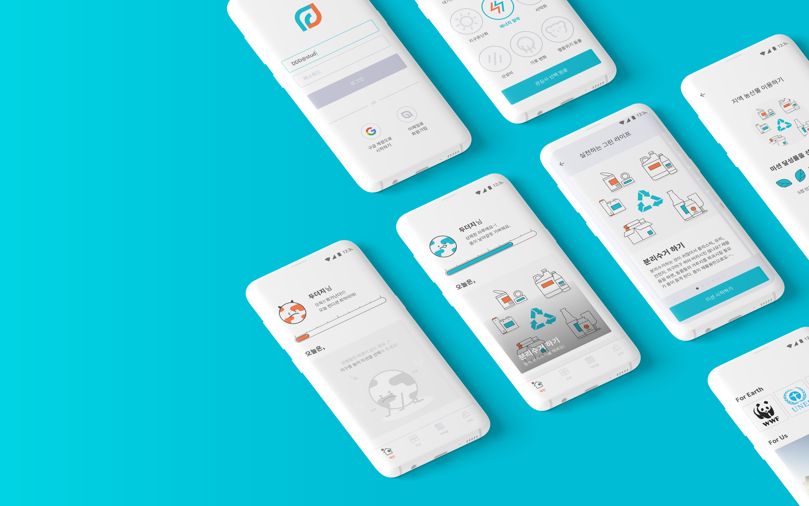

# For Earth For Us 

DDD. 2기에서 활동한 주워온 두더지팀의 **For Earth For Us**입니다.

# OverView

지구를 위한 첫 걸음. 환경 보호 실천 미션 리스트 제공 앱 서비스입니다. 
> 심각해진 환경오염으로 인해 많이 아픈 지구를 어떻게 살려낼 수 있을까요? 😭 우리의 작은 행동 하나하나가 모여 지구를 다시 살려낼 수 있습니다. 💪💪
지구를 위한 미션을 달성해서 지구를 지키는 활동에 동참해보세요~! 🌎

- 개발 기간 : 2019.04.10 ~ 2019.07.06
- Team
  - 개발자
    - 조제현
    - 이승우
  - 디자이너
    - 김수민
    - 정지현

# About

**Features**

1. 사용자마다 지키기 위한 지구 캐릭터가 존재합니다. 
2. 미션을 달성할 때마다 지구의 레벨이 오르며, Bar Graph 형태로 확인할 수 있습니다.
3. 미션은 총 7개의 카테고리로 제공되며, 카테고리별 미션이 존재합니다.
4. 실천하고 싶은 미션을 선택하고 수행한 뒤 미션 완료 버튼을 누릅니다.
5. 달성률과 메시지를 작성하고 완료하면 지구 레벨이 오르고 점차 건강한 지구의 모습을 확인할 수 있습니다.
6. 지구를 위한 후원처와 아티클에 대한 정보를 제공합니다.

**Technology Stack**

- Tools : Android Studio 3.4
- Language : Kotlin
- DI : koin
- Architecture Pattern : MVVM Pattern
- Android Architecture Components(AAC)
  - LiveData
  - ViewModel
  - Data Binding
- RxJava2
- Motion Layout

**Library**

- [Material Desing](https://material.io/develop/android/)
- [lifecycle(LiveData, ViewModel)](https://developer.android.com/jetpack/androidx/releases/lifecycle)
- [anko](https://github.com/Kotlin/anko)
- [circle ImageView](https://github.com/hdodenhof/CircleImageView)
- [RxJava2](https://github.com/ReactiveX/RxAndroid)
- [retrofit2](https://github.com/square/retrofit)
- [okhttp](https://github.com/square/okhttp)
- [glide](https://github.com/bumptech/glide)
- [svg](https://bigbadaboom.github.io/androidsvg/)
- [rounded ImageView](https://github.com/vinc3m1/RoundedImageView)
- [circle indicator](https://github.com/ongakuer/CircleIndicator)
- [koin](https://github.com/InsertKoinIO/koin)

# ToDo
- 자체적인 알람 기능 구현.
- 스크랩 통신 기능 수정.
- 로딩 시 UX를 고려해서 갑자기 뜨는 것 말고 로딩을 위한 작업 필요.

# WireFrame

